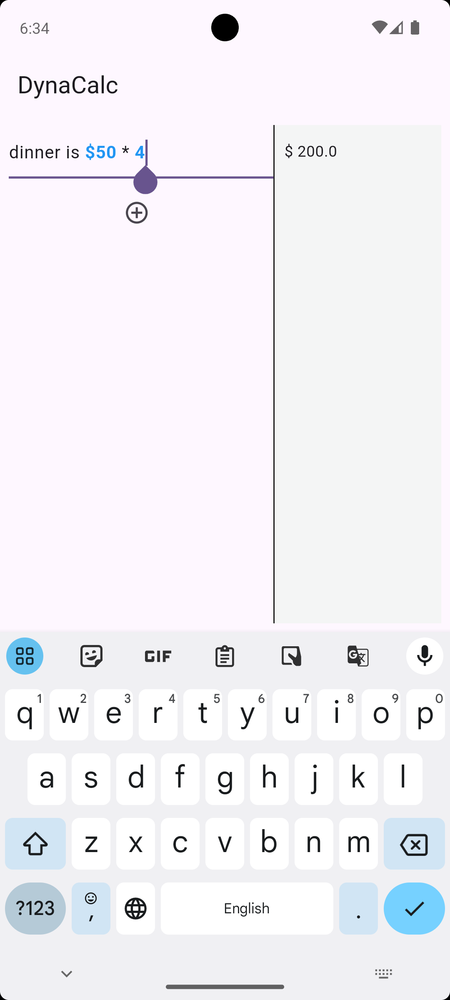

# Dynacalc

Notes to math results instantly (Implementation of the Soulver App on iOS in Flutter)

## Overview

**Dynacalc** is a dynamic calculator that seamlessly combines the functionality of a calculator with note-taking. It allows users to write natural language statements and automatically calculates the totals, displaying them in adjacent cells. Dynacalc supports various mathematical operations such as addition, subtraction, multiplication, division, and percentages.

## Features

- **Dynamic Calculations:** Write statements like "The hotel was $40 for 3 nights" and see the total calculated instantly.
- **Supports Multiple Operations:** Use percentages, addition, subtraction, multiplication, and division within your notes.
- **User-Friendly Interface:** Clean and intuitive design for easy note-taking and calculations.
- **Real-Time Updates:** Calculations are updated in real-time as you type.

## Screenshots




## Installation

1. **Clone the repository:**
   ```bash
   git clone https://github.com/Wh0ba/dynacalc.git
   ```
2. **Navigate to the project directory:**
   ```bash
   cd dynacalc
   ```
3. **Install dependencies:**
   ```bash
   flutter pub get
   ```
4. **Run the app:**
   ```bash
   flutter run
   ```

## Usage

1. **Open Dynacalc:** Start the application on your device.
2. **Create a Note:** Write natural language statements including numbers and operations.
3. **See the Calculations:** The total will be displayed in the cell next to your written statement.
4. **Edit and Update:** Modify your notes and see the calculations update in real-time.

## Examples

- Write: `The hotel was $40 for 3 nights`
  - Result: `Total: $120`
- Write: `Dinner cost $50 * 5`
  - Result: `Total: $250`
- Write: `Discounted price: $100 - 15%`
  - Result: `Total: $85`

## Contributing

Contributions are welcome! Please follow these steps:

1. Fork the repository.
2. Create a new branch (`git checkout -b feature-branch`).
3. Make your changes.
4. Commit your changes (`git commit -am 'Add new feature'`).
5. Push to the branch (`git push origin feature-branch`).
6. Create a new Pull Request.

## License

This project is licensed under the GNU 3.0 License. See the [LICENSE](LICENSE) file for more details.
